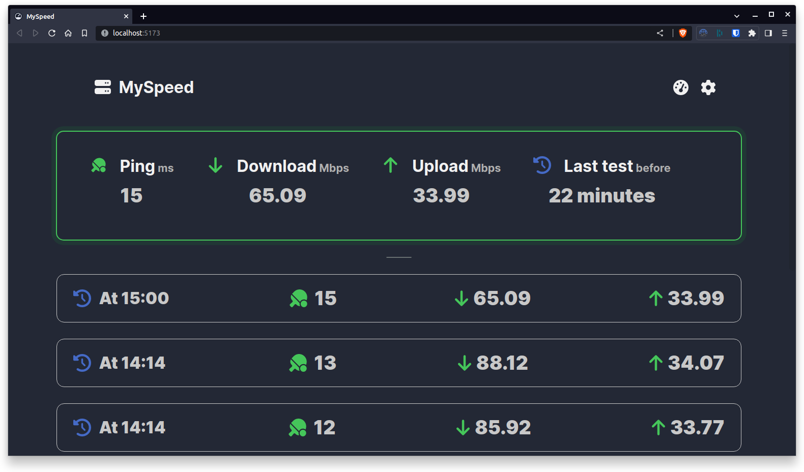

<!--
NB: Deze README is automatisch gegenereerd door <https://github.com/YunoHost/apps/tree/master/tools/readme_generator>
Hij mag NIET handmatig aangepast worden.
-->

# MySpeed voor Yunohost

[](https://ci-apps.yunohost.org/ci/apps/myspeed/)


[](https://install-app.yunohost.org/?app=myspeed)

*[Deze README in een andere taal lezen.](./ALL_README.md)*

> *Met dit pakket kun je MySpeed snel en eenvoudig op een YunoHost-server installeren.*  
> *Als je nog geen YunoHost hebt, lees dan [de installatiehandleiding](https://yunohost.org/install), om te zien hoe je 'm installeert.*

## Overzicht

MySpeed is a speed test analysis software that stores the speed of your internet for up to 30 days. This can also be useful if you want to know when your network might have drops or if you want to check if your internet matches the booked values from your contract.


**Geleverde versie:** 1.0.9~ynh1

## Schermafdrukken



## Documentatie en bronnen

- Officiele website van de app: <https://myspeed.dev/>
- Officiele beheerdersdocumentatie: <https://docs.myspeed.dev/>
- Upstream app codedepot: <https://github.com/gnmyt/myspeed>
- YunoHost-store: <https://apps.yunohost.org/app/myspeed>
- Meld een bug: <https://github.com/YunoHost-Apps/myspeed_ynh/issues>

## Ontwikkelaarsinformatie

Stuur je pull request alsjeblieft naar de [`testing`-branch](https://github.com/YunoHost-Apps/myspeed_ynh/tree/testing).

Om de `testing`-branch uit te proberen, ga als volgt te werk:

```bash
sudo yunohost app install https://github.com/YunoHost-Apps/myspeed_ynh/tree/testing --debug
of
sudo yunohost app upgrade myspeed -u https://github.com/YunoHost-Apps/myspeed_ynh/tree/testing --debug
```

**Verdere informatie over app-packaging:** <https://yunohost.org/packaging_apps>
